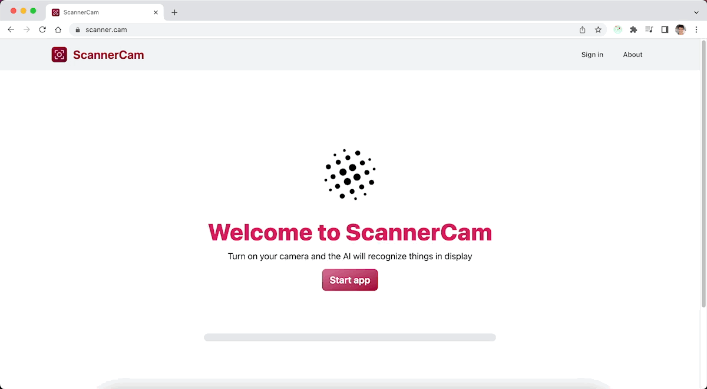
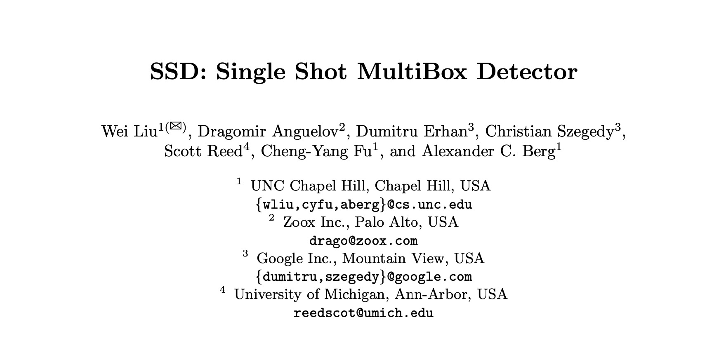

  
  <h1 align="center">📸 Scanner Cam 🔊</h1>

  📸 Camera object recognizer with object-to-voice integrated. 🤖

  <a href="https://scanner.cam">www.scanner.cam</a>

## 🤖 Concept

ScannerCam is a web application that uses the [TensorFlow.js](https://www.tensorflow.org/js) computer vision library to detect objects in real time with the camera of a mobile device or a computer.

## 🛠 Core Development

These are the main technologies used to build ScannerCam:

### 🧠 Machine Learning

**ScannerCam** is a web application that contains a camera module (capable of reverting to environment camera and front camera on mobile devices) whose frames are fed in real time to the COCO-SSD model (COCO stands for [Common Objects In Context](https://cocodataset.org/#home)) (SSD stands for [Single Shot MultiBox Detection](https://arxiv.org/abs/1512.02325)) of [TensorFlow.js](https://www.tensorflow.org/js) computer vision to detect up to 80 object classes.

> "We present a method for detecting objects in images using a single deep neural network. Our approach, named SSD, discretizes the output space of bounding boxes into a set of default boxes over different aspect ratios and scales per feature map location." From the [SSD: Single Shot MultiBox Detector](https://arxiv.org/abs/1512.02325) paper.

When the user clicks the button "Start app", the app requests the Machine Learning Model from the TensorFlow.js Hub. The TensorFlow.js Hub then responds by sending the model's architecture and weights to the app.

Once the model is ready, it is not necessary to download it again. The model is stored in the browser's cache. This way, the app can work offline after the first load.

If you want to know more about the COCO-SSD model, you can read the [TensorFlow.js documentation](https://www.tensorflow.org/js/models).

### 🎙 Speech Synthesis

It also uses the [Speech Synthesis API](https://developer.mozilla.org/en-US/docs/Web/API/SpeechSynthesis) to talk about objects detected on camera while the option is active. This feature is called object-to-voice.

Both features have language internationalization support in English and Spanish. The language change happens by the user's preferred language in the browser.

### 🪐 User Interface

ScannerCam UI was built on [React v18](https://reactjs.org/blog/2022/03/29/react-v18.html) with TypeScript.

It is responsive. And it's also available with a beautiful light and dark mode based on the user's preferred color scheme in the browser.

### ✅ Testing

ScannerCam is continuously tested with [Playwright](https://playwright.dev/). Playwright is a Node.js library to automate Chromium, Firefox, and WebKit with a single API.

More than 10 assertions are made to ensure that the app is working correctly.

The tests are located in the [`tests`](./tests) folder.

### 🛩 Deployment

ScannerCam is deployed on [Vercel](https://vercel.com). Vercel is a cloud platform for static sites, hybrid apps, and Serverless Functions.

## 🎨 UI Design

ScannerCam has a simple and clean design. It is based on the [Material Design](https://material.io/design) guidelines.

The library used to build the interface is [TailwindCSS](https://tailwindcss.com). It is a utility-first CSS framework for rapidly building custom user interfaces.

The colors chosen to paint Scanner Cam are shades of red that change depending on the user's preference in dark mode and light mode.

- Red darker: `#6A0012`
- Red dark: `#A00037`
- Red candydark: `#D81B60`
- Red candylight: `#FF5C8D`
- Red light: `#FF90BD`
- Red lighter: `#FFC2EF`

## 🤲 Contributing

Do you would like to contribute? Do you want to be the author of a new feature? Awesome! please fork the repository and make changes as you like. [Pull requests](https://github.com/360macky/scanner-cam/pulls) are warmly welcome.

## 📃 License

Distributed under the MIT License.

See [`LICENSE`](./LICENSE) for more information.
